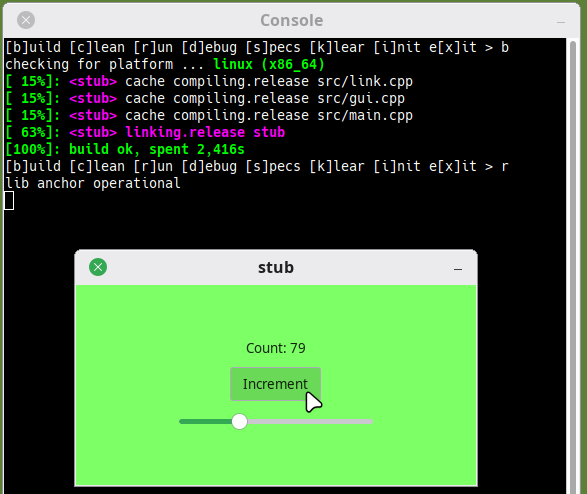
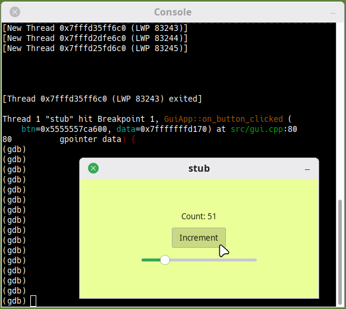

# stub
Minimal c++17 gtk4 app using xmake and gcc.

## Features
- Increment button counts 0 to 255, then backwards.
- Horizontal slider sets count directly.
- Background color shifts through prism based on count.
- Mutex-protected message queue for event handling.

## Requirements
- python3
- xmake
- gcc

## Usage
- execute the run script on linux with xfce4:
```bash
run.sh
```

- execute the run script on windows:
```batch
run.bat
```

## Commands
```bash
- [i]nit         -- install xmake if missing
- [s]pecs        -- install xmake packages from spec.md
- [b]uild        -- compile the application
- [c]lean        -- remove build artifacts
- [r]un          -- execute in release mode
- [d]ebug        -- execute in debug mode with gdb
- [k]lear        -- clear terminal
- [x]it          -- terminate script
```

## Test
<br>
- in release mode
<div style="text-align: center;">
  
</div>

<br>
- in debug mode
<div style="text-align: center;">
  
</div>

## File tree
```bash
doc/            -- images inside
out/            -- generated build folder for debug | release modes
lib/            -- place static libraries inside
src/            -- all cpp sources are inside
src/root.hpp    -- global includes and type aliases.
src/link.hpp
src/link.cpp    -- static library anchor.
src/gui.hpp
src/gui.cpp     -- gtk4 window and event loop.
src/main.cpp    -- application entry point.
run.py          -- cross-platform build and run automation.
run.sh          -- run script for linux xfce4 bash
run.bat         -- run script for windows batch
spec.md         -- xmake dependencies
xmake.lua       -- xmake build script
```

## Debug
- some useful commands to get started
```bash
break main
break GuiApp::on_button_clicked
run
next
step
backtrace
continue
quit
```

Copyright (c) 2026 alexander14k28@gmail.com

See [LICENSE](LICENSE) for the license governing this project.
